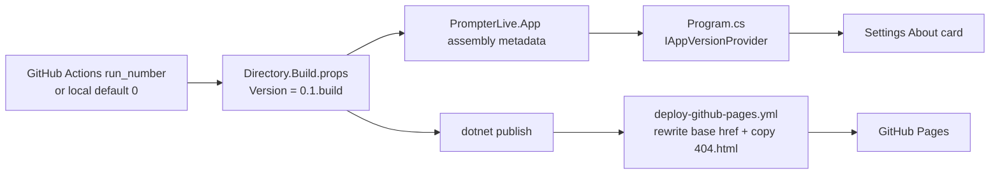

# App Versioning And GitHub Pages

## Scope

`PrompterLive` exposes the running app version inside the Settings About screen and publishes the standalone WebAssembly build to GitHub Pages.

This flow keeps the version number automated:

- local builds default to `0.1.0`
- CI builds derive `0.1.<run_number>` from the active GitHub Actions run
- the About screen reads the compiled assembly metadata instead of hardcoded copy

## Version And Deploy Flow

## Source Of Truth

- `Directory.Build.props` is the only source of app version composition.
- `PrompterLiveBuildNumber` comes from `GITHUB_RUN_NUMBER` when CI provides it, or falls back to `0` locally.
- `Program.cs` creates `IAppVersionProvider` from the compiled `PrompterLive.App` assembly metadata.
- `SettingsAboutSection` renders that provider value in the About card subtitle.

## GitHub Pages Rules

- GitHub Pages publishes the standalone `src/PrompterLive.App` artifact only.
- The workflow copies the published `wwwroot` output, not the host wrapper files around it.
- The workflow rewrites `<base href="/">` to `/<repo-name>/` only inside the Pages artifact.
- The workflow copies `index.html` to `404.html` so client-side routes keep working on repository Pages hosting.
- `.nojekyll` must be present in the Pages artifact so framework and `_content` assets are served as-is.

## Verification

- `dotnet test /Users/ksemenenko/Developer/PrompterLive/tests/PrompterLive.App.Tests/PrompterLive.App.Tests.csproj --filter "FullyQualifiedName~SettingsInteractionTests.AboutSection_RendersInjectedAppVersionMetadata"`
- `dotnet test /Users/ksemenenko/Developer/PrompterLive/tests/PrompterLive.App.UITests/PrompterLive.App.UITests.csproj --filter "FullyQualifiedName~TeleprompterSettingsFlowTests.TeleprompterAndSettingsScreens_RespondToCoreControls"`
- `.github/workflows/deploy-github-pages.yml` publish step passes `-p:PrompterLiveBuildNumber=${{ github.run_number }}`
