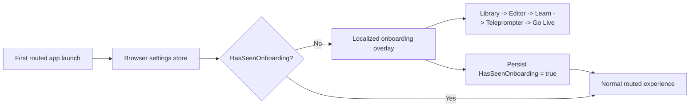
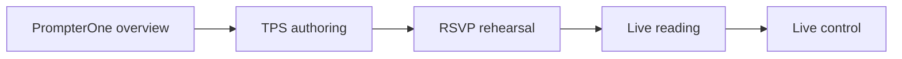
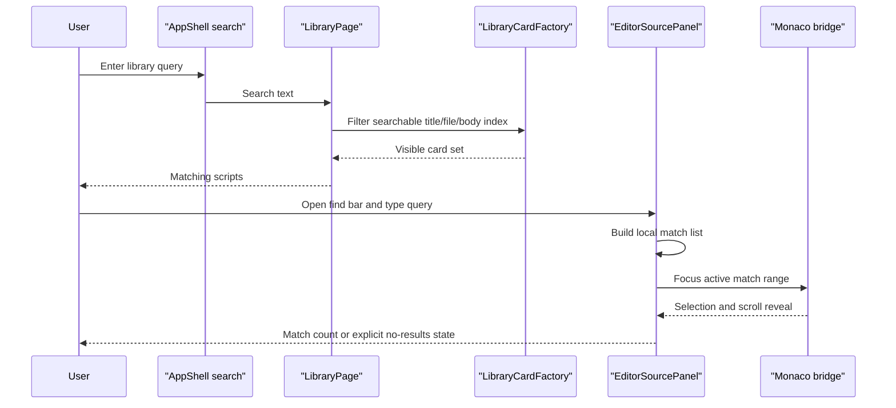

# Onboarding And Search Experience

## Intent

PrompterOne now explains itself on first launch instead of dropping a new user into a dense browser studio with no context. The first-run walkthrough introduces the product model, TPS, RSVP, Editor, Learn, Teleprompter, and Go Live, then stays dismissed once the user finishes or explicitly opts out.

The tour can be reopened later from the library header or from the Settings About section. The shell button replays the guided flow in place, and the Settings action routes the user back to Library with an onboarding request so the overlay can open again.

The walkthrough is intentionally ordered as:

1. PrompterOne overview and library search.
2. TPS authoring in the Editor.
3. RSVP rehearsal in Learn.
4. Live reading in the Teleprompter.
5. Live control in Go Live.

The wording follows the upstream TPS README definitions of TPS as a markdown-based script format with timing, emotion, pauses, delivery cues, and runtime surfaces for rehearsal and live reading: <https://github.com/managedcode/TPS/blob/main/README.md>.

The same slice also makes script discovery and authoring searchable:

- Library search matches script title, stored file name, and script body content.
- Editor search lets the user find text inside the current TPS document without leaving the routed editor.

## First-Run Flow

## Onboarding Story Map

## Search Contracts

## Current Behavior

- `MainLayout` checks `SettingsPagePreferences.HasSeenOnboarding` from the browser-owned settings store after bootstrap.
- When the flag is `false`, the shell mounts a localized onboarding overlay and routes the user through the PrompterOne overview, Editor, Learn, Teleprompter, and Go Live.
- Completing the tour or choosing `Not interested` persists the same browser-local settings flag, hides the overlay, and returns the user to Library.
- Reopening the tour from the shell uses the current route and replays the overlay without clearing the seen flag.
- Reopening the tour from Settings navigates to `Library?onboarding=1`, which causes the shell to show the same overlay again even after completion.
- Onboarding copy is localized for all supported UI cultures: `en`, `uk`, `fr`, `es`, `it`, `de`, and `pt`.
- The onboarding copy explains the product model in user terms:
  - PrompterOne is browser-first and local-first, with script search and a single shared workflow.
  - TPS is the structured plain-text TelePrompterScript format used across authoring and reading.
  - RSVP in Learn is for focused rehearsal and pacing.
  - Teleprompter is the live reading surface.
  - Go Live is the browser control surface for program, routing, and recording state.
- Library search no longer depends only on visible card title/author metadata; it now searches normalized title, document name, author, and stored script body text.
- Editor search is Blazor-owned state with a thin Monaco focus bridge: the query, match counting, empty state, and next/previous controls live in `EditorSourcePanel`, while Monaco only receives the selected range to reveal.
- Test harnesses seed onboarding as already seen by default so unrelated browser and component suites keep their old baseline; onboarding-specific tests explicitly override the stored flag to `false`.

## Verification

- `dotnet build ./PrompterOne.slnx -warnaserror`
- `dotnet test ./tests/PrompterOne.Web.Tests/PrompterOne.Web.Tests.csproj --filter "FullyQualifiedName~MainLayoutOnboardingTests|FullyQualifiedName~LibrarySearchInteractionTests|FullyQualifiedName~EditorSourcePanelFindTests"`
- `dotnet test ./tests/PrompterOne.Web.Tests/PrompterOne.Web.Tests.csproj --no-build --filter "FullyQualifiedName~ScreenShellContractTests|FullyQualifiedName~MainLayoutActionTests|FullyQualifiedName~EditorSourcePanelInteractionTests|FullyQualifiedName~Library"`
- `dotnet test ./tests/PrompterOne.Web.UITests/PrompterOne.Web.UITests.csproj --no-build --filter "FullyQualifiedName~OnboardingFlowTests|FullyQualifiedName~LibrarySearchFlowTests|FullyQualifiedName~EditorFindFlowTests"`
- `dotnet test ./tests/PrompterOne.Web.UITests/PrompterOne.Web.UITests.csproj --no-build --filter "FullyQualifiedName~OnboardingFlowTests|FullyQualifiedName~LibraryScreenFlowTests|FullyQualifiedName~LibrarySearchFlowTests|FullyQualifiedName~EditorFindFlowTests|FullyQualifiedName~EditorToolbarSemanticVisualTests|FullyQualifiedName~LocalizationFlowTests"`
