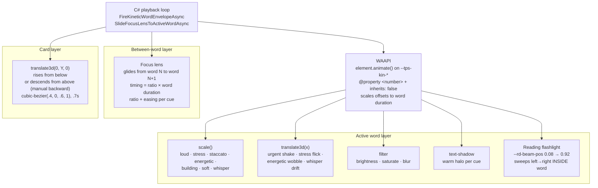
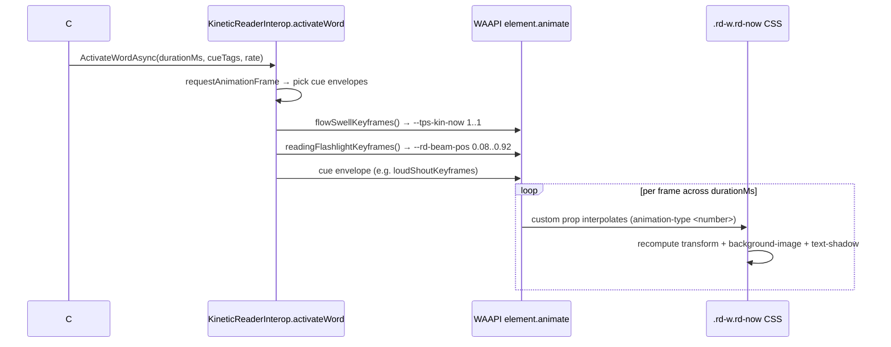
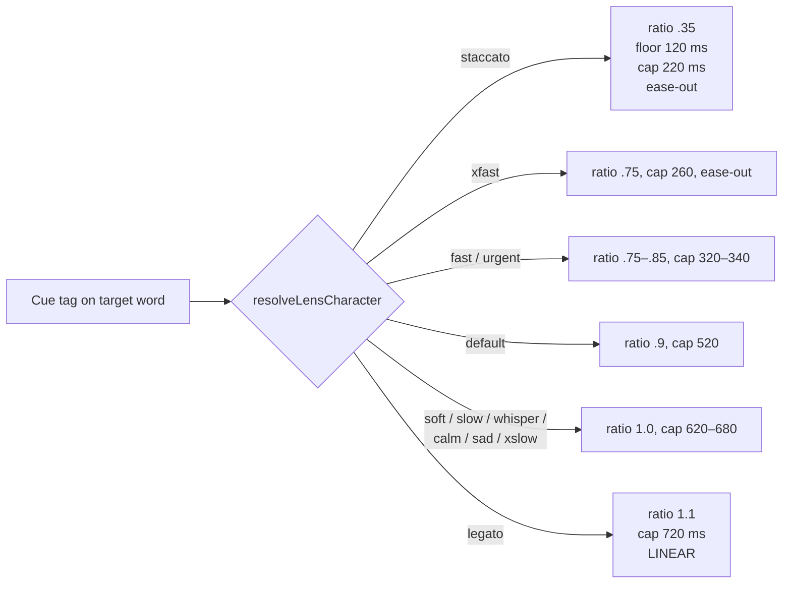
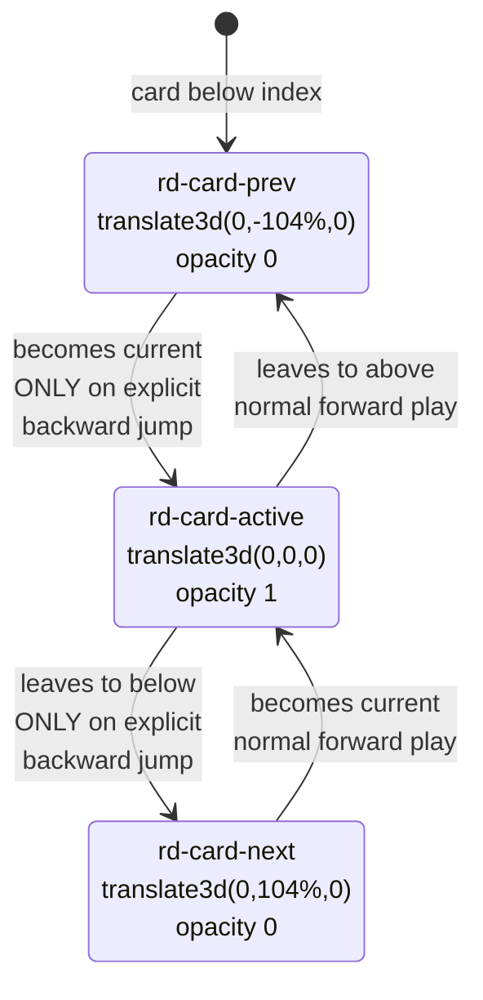
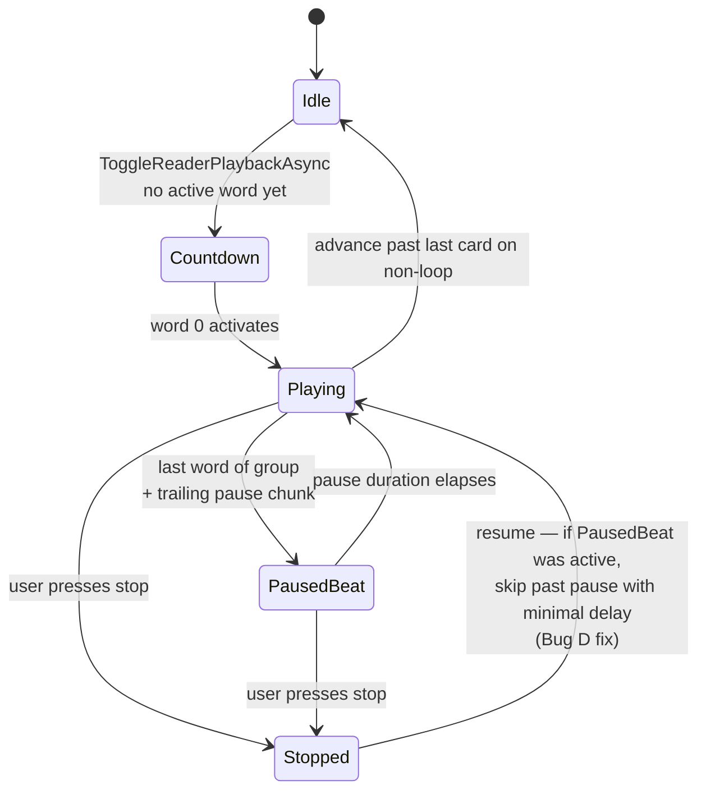

# Reader Animations

## Intent

The teleprompter reader is a **rehearsal instrument**, not a decorative
surface. Every visual cue is designed to help the operator read with the
right rhythm, volume, emotion, and articulation — intuitive enough that
a reader who has never seen the script can guess how to say each word
from its appearance alone.

This document describes every animated visual the reader produces,
where it comes from (CSS / JS / C#), how it composes with the others,
and why each one exists.

## Guiding principles

1. **Layout stability is absolute.** No cue ever changes a word's
   bounding box between preview and active states. Layout-affecting
   properties (`font-weight`, `font-style`, `letter-spacing`) live on
   the BASE cue class so the same width applies preview and active.
   `display: inline-block` + CSS `transform: scale()` / `translate()`
   are compositor-only — siblings never shift, the line-height never
   changes.
2. **Legato by default.** Plain (non-cue) words do not pulse, scale,
   or bounce. Only `color` and the global halo change between states,
   with a short `.22s` transition. The travelling feeling comes from
   the separate **focus lens**, not from word flicker.
3. **Cue identity is the accent.** Each TPS cue tag modulates a
   specific variable (scale, translateX, filter, shadow) that the CSS
   reads via `var(--tps-kin-*, 0)`. When the cue is absent the variable
   stays at 0 → no contribution, no visible change.
4. **Forward playback always rises.** Card transitions during normal
   playback — including wrap-around from the last card back to card 0 —
   always move upward (outgoing card exits up, incoming card rises
   from below). Only an explicit manual backward jump reverses motion.
5. **Accessibility: cue kinetics are informational.** The
   `prefers-reduced-motion: reduce` override has been intentionally
   removed from this reader — the cue visuals ARE the reading hints
   (a loud word is meant to LOOK loud). Skipping them would leave a
   rehearsal tool without its rehearsal guidance.

## Three kinetic layers

## TPS cue → visual character

Each TPS cue drives one or more per-word CSS variables. Values below
are the CSS multipliers applied on `.rd-w.rd-now`; WAAPI animates the
variable envelope over the word's wall-clock duration.

| Cue | Scale Δ | TranslateX peak | Filter contribution | Other | Envelope shape |
|---|---|---|---|---|---|
| plain | — | — | brightness+.18 · saturate+.06 | reading flashlight | flat 1 |
| `[loud]` | +.09 | — | brightness+.32 · saturate+.38 | huge warm halo via text-shadow | 0 → 1 @ 15 % → 0.8 @ 50 % → 0.55 |
| `[soft]` | −.05 | — | brightness−.08 | cool glow | 0.2 → 1 → 0.4 |
| `[whisper]` | −.08 | ±2.5 px drift | blur 1.2 px · saturate−.28 · brightness−.18 | dotted underline + mask | 0 → 1 → 0.3 (drifts leftward throughout) |
| `[urgent]` | — | ±8 px shake | brightness+.28 · saturate+.48 | Apple-style 7-oscillation decay | 0 → 1 @ 7 % → damped oscillation → 0.2 |
| `[stress]` | +.08 | ±5 px flick | — | sforzando accent `> ` mark + drop-shadow | 0 → 1 @ 8 % → −0.5 @ 22 % → 0 |
| `[staccato]` | +.06 | — | brightness spike | dot above word + box-shadow pulse | 0 → 1 @ 12 % → 0.5 @ 30 % → 0.1 |
| `[energetic]` | +.04 | ±4 px wobble | brightness+.18 · saturate+.34 | warm orange palette | 0 → .8 → 1 → .7 → .3 |
| `[excited]` | +.04 | ±4 px wobble | same as energetic | pink/cyan palette | inherits energeticKeyframes |
| `[building]` | +.03 | — | — | per-run `--tps-build-progress` + per-word `--tps-kin-building` glow | 0 → 1 monotonic |
| `[calm]` | — | — | gentle mint hue | subtle text-shadow breath via `--tps-kin-calm` | 0 → 1 → 0 |
| `[legato]` | — | — | cyan hue + group-level arc underline | shadow breath via `--tps-kin-calm` + **lens uses linear glide 110 % × word** | shares calmFloatKeyframes |
| `[aside]` | — | — | gray italic + parentheses | shadow breath | shares calmFloatKeyframes |
| emotion tags (warm/happy/focused/...) | — | — | hue-tinted color + static shadow | — | — |
| `[xslow]` / `[slow]` | — | — | static `letter-spacing` | lens uses gentler 0.55 s ratio | — |
| `[fast]` / `[xfast]` | — | — | static `letter-spacing` (tighter) | lens tightens toward 0.22–0.3 s | — |

All scale contributions additively combine in one `calc()` so a word
tagged both `[loud]` and `[stress]` can scale up to ~1.17. The x-axis
contributions combine the same way.

## Reading flashlight

**New layer**, introduced alongside the full animation pass. A soft
warm circle (`radial-gradient` on the word's `background-image`) sits
inside the active word's box. The circle is painted statically at the
gradient's centre; the **`background-position`** property is animated
by WAAPI from `-42% 50%` to `42% 50%`, sliding the entire gradient
horizontally across the word's own box over its wall-clock duration.
Going through `background-position` (instead of a custom property
inside the gradient `calc()`) guarantees every browser repaints per
frame — Chromium sometimes skips the repaint when `@property` custom
props change only inside the gradient expression.

### Why the flashlight is separate from the focus lens

| | Focus lens | Reading flashlight |
|---|---|---|
| Scope | BETWEEN words | INSIDE the active word |
| Element | `.rd-focus-lens` (abs-positioned child of cluster-text) | `background-image` on `.rd-w.rd-now` itself |
| Motion | glides from word N's rect to word N+1's rect | sweeps 0.08 → 0.92 across the word's own width |
| Timing | ratio × word duration, cue-picked easing | constant 0 → 1 linear via WAAPI (overlaps the rest) |
| Purpose | "the next beat is over there" | "you are reading HERE right now" |

Together they produce the **two-scale reading guide**: the lens tells
the operator which word is current; the flashlight tells the operator
which **part** of that word is currently in flight. The eye follows
both in the same direction without conflict — the lens is slow (word
duration), the flashlight is also word-duration but restricted to the
active word's bounding box.

## Focus lens timing per cue

The lens transition duration is `ratio × scaled word duration`,
clamped by `floor`/`cap`. Staccato forces a snap even on a slow word;
legato keeps a glide even on a fast word.

## Card transition

Key mechanics:

1. **Explicit direction.** `AdvanceToCardAsync(nextIndex, cancellationToken, explicitDirection)`
   accepts an explicit `+1` / `-1`. The playback loop passes `+1` even
   on wrap (last → 0) so the wrap case cannot accidentally be
   classified as backward and render the incoming card descending from
   above.
2. **Snap + commit + animate.** `PrepareReaderCardTransitionAsync`
   tags the incoming card with `rd-card-static` (transition: none) so
   it snaps from whatever its natural position was to the correct
   starting edge (+104 % for forward, −104 % for backward) without
   animation. A `KineticReaderInterop.commitFrame()` JS helper waits
   for a **double `requestAnimationFrame`** before removing the
   static class, guaranteeing the browser has painted the snap before
   the transition is re-enabled. Without this commit, wrap-around
   playback interpolated from the card's previous position and
   visibly descended from the top.

## State tracking

Playback state fields (`TeleprompterPage.razor.cs`):

- `_activeReaderCardIndex` — current card.
- `_activeReaderWordIndex` — current word ordinal within that card
  (`−1` during countdown / card transition).
- `_activeReaderPauseChunkIndex` — non-null only during an active
  pause beat; preserved through `StopReaderPlaybackLoop` so a
  stop-then-resume while mid-pause skips the already-played rest
  (was a real bug — user stopped mid-pause, resume re-played the
  word before the pause for its full duration).

## Bugs fixed during the animation overhaul

Each bug below had a user-visible symptom; every fix is now live in
`src/PrompterOne.Shared/Teleprompter/`.

| Bug | Symptom | Fix |
|---|---|---|
| Pause-resume replay | stop mid-pause → resume played the preceding word again for its full duration | `StopReaderPlaybackLoop` keeps `_activeReaderPauseChunkIndex`; `ToggleReaderPlaybackAsync` resume path uses `MinimumReaderLoopDelayMilliseconds` to advance past the pause |
| Cue-word width shift | word's neighbours jumped left/right when a cue word became rd-now | All layout-affecting props (`font-weight`, `font-style`, `letter-spacing`) moved to BASE cue class so width is identical preview ↔ active |
| Plain-word flicker | every word pulsed (scaled + shadow-swelled) under `--tps-kin-now` envelope | `flowSwellKeyframes` flattened to constant `1`; `--tps-kin-now` no longer contributes to scale |
| Wrap-around descent | playback wrap from last card to 0 sent the incoming card DOWN from above instead of rising from below | `PrepareReaderCardTransitionAsync` accepts `explicitDirection`; playback loop passes `ReaderCardForwardStep` on wrap |
| Card snap not committed | `Task.Yield()` in `PrepareReaderCardTransitionAsync` did not guarantee a browser paint between the "snap to starting edge" frame and the "transition-enabled" frame — wrap-around sometimes interpolated from stale prev position | New `KineticReaderInterop.commitFrame()` JS helper resolves only after a double `requestAnimationFrame`; C# awaits it instead of `Task.Yield()` |
| Stale lens on card entry | lens kept its `rd-focus-lens-active` class from a previously-visited card, appearing at a stale position until the first word activated | `HideFocusLensAsync(previousCardIndex)` called before card state flips |
| Lens snap-from-corner on first show | lens visibly slid from (0, 0) to the first active word on card entry | `positionFocusLensForTarget` detects first show via missing active class; positions WITHOUT transition, then fades opacity in |
| Lens position stale after font/width/focal change | operator changed settings during playback → lens stuck on old pixel coordinates | `AlignActiveReaderTextAsync` re-invokes `SlideFocusLens…Async` after alignment completes |
| Orphan `--tps-kin-calm` | calm / aside / legato cues animated a variable nothing read | Added `.rd-w.rd-now.tps-calm/legato/aside` text-shadow rules that read the variable |
| Orphan `--tps-kin-building` | WAAPI animated a variable CSS used `--tps-build-progress` instead | `.rd-w.rd-now.tps-building` text-shadow reads BOTH static progress and kinetic envelope |
| Reading wave muddying the cluster | anticipation / lingering rules brightened neighbours around the focus word so the preview cluster was constantly rewriting itself | rolled back; lens owns the flow between words, cluster stays stable |
| Reduce-motion bailout | JS `activateWord` early-returned under `prefers-reduced-motion: reduce`, silently stripping every kinetic from the reader | `isReducedMotion` and its media query removed entirely — cue kinetics are rehearsal guidance, not eye candy |
| Dead `@media (prefers-reduced-motion)` CSS block | legacy `animation: none !important` on cues that no longer used CSS @keyframes animation | Removed |
| Duplicate rd-now cue rules | `.rd-w.rd-now.tps-emphasis / strong / italic` were defined twice with different colors; later flatter rule overrode the richer earlier one | Removed the overriding duplicates; the two-layer warm/cream/violet designs now apply |
| Cue-preview-colour flash | cue hues only kicked in once `rd-g-active` was applied (after first word rendered), making the cue colours pop in AFTER the card faded in | Scope changed from `.rd-g-active >` to `.rd-card-active` — cue tints are present from the first paint of a new card |

## Source-of-truth files

- **CSS**: [src/PrompterOne.Shared/wwwroot/design/modules/reader/10-reading-states.css](../../src/PrompterOne.Shared/wwwroot/design/modules/reader/10-reading-states.css)
- **JS**: [src/PrompterOne.Shared/wwwroot/teleprompter/kinetic-reader.js](../../src/PrompterOne.Shared/wwwroot/teleprompter/kinetic-reader.js)
- **C# interop**: [src/PrompterOne.Shared/Teleprompter/Services/KineticReaderInterop.cs](../../src/PrompterOne.Shared/Teleprompter/Services/KineticReaderInterop.cs)
- **C# playback**: [src/PrompterOne.Shared/Teleprompter/Pages/TeleprompterPage.ReaderPlayback.cs](../../src/PrompterOne.Shared/Teleprompter/Pages/TeleprompterPage.ReaderPlayback.cs)
- **C# transitions**: [src/PrompterOne.Shared/Teleprompter/Pages/TeleprompterPage.ReaderTransitions.cs](../../src/PrompterOne.Shared/Teleprompter/Pages/TeleprompterPage.ReaderTransitions.cs)
- **C# alignment**: [src/PrompterOne.Shared/Teleprompter/Pages/TeleprompterPage.ReaderAlignment.cs](../../src/PrompterOne.Shared/Teleprompter/Pages/TeleprompterPage.ReaderAlignment.cs)
- **Razor template**: [src/PrompterOne.Shared/Teleprompter/Pages/TeleprompterPage.razor](../../src/PrompterOne.Shared/Teleprompter/Pages/TeleprompterPage.razor)

## Verification

- Build: `dotnet build ./src/PrompterOne.Shared/PrompterOne.Shared.csproj -warnaserror`
- Smoke-test in the browser against `starter-tps-cue-matrix.tps` — each
  cue family should show its documented motion character (see table
  above), the focus lens should glide between words, the reading
  flashlight should sweep inside the active word, and card transitions
  should only ever move up (forward playback) or down (manual back jump).
- Browser test harness: `tests/PrompterOne.Web.UITests.Reader` covers
  reader layout, TPS cue parity, and playback timing.
