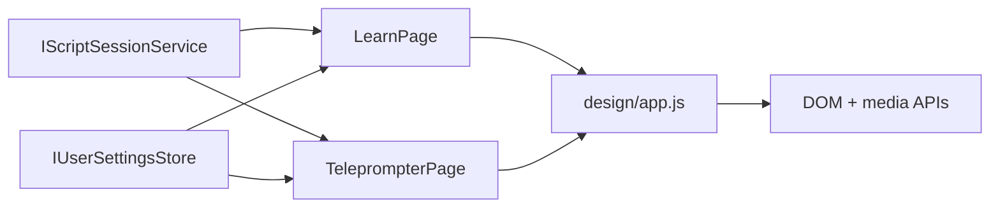

# Reader Runtime

## Intent

`learn` and `teleprompter` must follow `/Users/ksemenenko/Developer/PrompterOne/new-design/index.html` closely at runtime, not only in static markup.

The important contracts are:

- RSVP keeps the ORP letter centered on the vertical guide.
- RSVP builds phrase-aware timing from TPS scripts, not only from flat word lists.
- RSVP keeps a five-word context rail on each side, matching `new-design/app.js`.
- Teleprompter camera stays behind the text as one background layer.
- Teleprompter word groups stay short enough to avoid run-on lines.
- Teleprompter preserves TPS word presentation details such as pronunciation guides, inline colors, emotion styling, and speed-derived spacing/timing.
- Teleprompter pre-centers the next card before it slides in, so block transitions do not jump at the focal line.
- Teleprompter block transitions always move in one upward direction: the outgoing card exits up and the incoming card rises from below.
- Teleprompter controls stay readable at rest; they must not fade until they become unusable.
- Teleprompter user-adjusted font size, text width, focal position, and camera preference survive reloads through the shared user-settings contract.

## Flow

## Runtime Rules

- `learn` uses the shared RSVP timeline from `RsvpTextProcessor` and `RsvpPlaybackEngine`.
- `learn` must finalize TPS phrase groups before building the runtime timeline, or the `Next` phrase preview becomes incorrect.
- `learn` centers the ORP by measuring against the full horizontal word row, matching `new-design/app.js`.
- `learn` shows five context words on the left and right rails when enough words are available.
- `teleprompter` selects one primary camera device for `#rd-camera`.
- `teleprompter` does not render overlay camera elements such as `#rd-camera-overlay-*`.
- `teleprompter` groups words by pauses, sentence endings, clause endings, and short phrase limits.
- `teleprompter` forwards TPS pronunciation metadata to word-level `title` / `data-pronunciation` attributes.
- `teleprompter` derives word-level pacing from the compiled TPS duration and carries effective WPM into the DOM for testable parity.
- `teleprompter` preserves TPS front-matter speed offsets and `[normal]` resets when rebuilding reader blocks, so relative speed tags keep both their timing math and subtle word-level spacing cues.
- `teleprompter` keeps TPS inline colors visible even when a phrase group is active or the active word is highlighted.
- `teleprompter` persists font scale, text width, focal point, and camera auto-start changes through `IUserSettingsStore` and restores them from stored `ReaderSettings` during bootstrap.
- `teleprompter` prepositions the next card below the focal line before activation, so forward and backward block jumps both animate upward instead of alternating direction.

## Verification

- bUnit verifies teleprompter background-camera markup and readable phrase groups.
- bUnit verifies product-launch TPS modifiers survive into teleprompter word markup, timing, and pronunciation metadata.
- bUnit verifies custom TPS `speed_offsets` front matter and `[normal]` resets survive into teleprompter word classes, styles, and effective-WPM metadata.
- bUnit verifies teleprompter restores persisted reader width, focal position, and font size and saves reader layout/camera preference changes back to stored `ReaderSettings`.
- Core tests verify TPS scripts generate RSVP phrase groups.
- Core tests verify shorthand inline WPM scopes such as `[180WPM]...[/180WPM]` survive nested tags.
- Core tests verify nested `speed_offsets:` front matter is parsed and applied to `xslow` / `slow` / `fast` / `xfast` scope math.
- Core tests verify legacy reader-settings payloads without `FocalPointPercent` deserialize with the default focal-point value.
- Playwright verifies ORP centering and the `security-incident` phrase-aware flow in `learn`.
- Playwright verifies there is no teleprompter overlay camera box and that phrase groups do not overflow.
- Playwright verifies the teleprompter camera button attaches and detaches a real synthetic `MediaStream` on the background video layer.
- Playwright verifies the full `Product Launch` teleprompter scenario, including visible controls, TPS formatting parity, screenshot artifacts, and aligned post-transition playback.
- Playwright verifies custom TPS speed offsets change computed teleprompter `letter-spacing` while `[normal]` words reset back to neutral spacing and timing.
- Playwright verifies teleprompter width and focal settings survive a real browser reload and that backward block jumps keep the outgoing card on the upward exit path during the transition.
